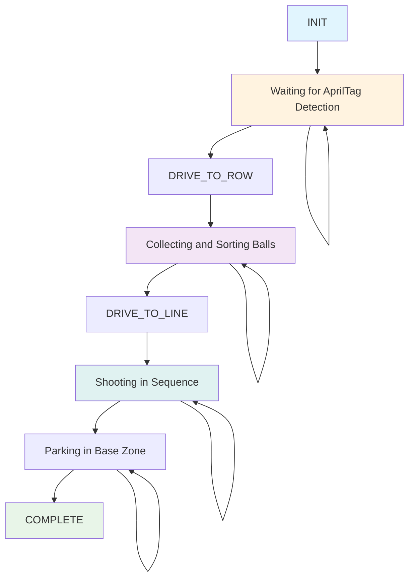

# FTC TeamCode - DECODE Autonomous System

## Overview

This repository contains the custom autonomous code for our FTC robot designed to compete in the DECODE (2025-2026) season. The system implements a complex state machine that handles AprilTag detection, ball collection, sorting, and shooting in the correct sequence.

## System Components

### 1. DecodeAutonomous
Main autonomous class that implements the complete state machine for the robot's autonomous routine.

### 2. AprilTagVisionProcessor
Handles AprilTag detection to identify the target color pattern at the beginning of the autonomous period.

### 3. BarrelController
Manages the barrel rotation and ball sorting mechanism with 3 servo-controlled slots for storing balls.

### 4. ShooterController
Controls the shooter motor and ball pushing mechanism for launching balls in the correct sequence.

### 5. BalldentifierAndDriver
Placeholder for OpenCV-based ball detection and tracking system (currently under development).

## Autonomous Logic Flow

The autonomous routine follows a state machine pattern with the following states:

1. **INIT**: Initialize hardware and systems
2. **READ_TAG**: Read AprilTag to determine target pattern
3. **DRIVE_TO_ROW**: Drive to the ball collection area
4. **INTAKE_AND_SORT**: Intake balls while sorting them by color
5. **DRIVE_TO_LINE**: Drive back to launch line
6. **SHOOT**: Shoot balls in the correct sequence
7. **FINAL_PARK**: Park in assigned base zone
8. **COMPLETE**: Autonomous routine complete

## Ball Sorting Algorithm

The system sorts balls based on the detected AprilTag pattern:
1. Detect ball color using the color sensor
2. Compare with the target sequence from AprilTag
3. Store in the appropriate barrel slot (0, 1, or 2)
4. Maintain maximum of 3 balls at any time

## Hardware Mapping

- Drive Motors: front_left_motor, front_right_motor, back_left_motor, back_right_motor
- Intake Motor: intake_motor
- Shooter Motor: shooter_motor
- Servos: wheel_rotation (for barrel), ball_push (for shooting)
- Sensors: color_sensor
- Camera: Webcam 1

## Constraints

- Maximum 3 balls stored at any time
- Barrel has exactly 3 storage slots
- Robot must finish autonomous in under 25 seconds
- Last ~5 seconds reserved for parking in assigned base zone
- Supports 4 scenarios: 2 starting launch lines × 2 alliance colors

## State Machine Diagram

## Current Status

### Completed
- Basic autonomous state machine implementation
- AprilTag detection and pattern recognition
- Barrel controller for ball sorting
- Shooter controller for ball launching
- Drive motor control for navigation
- Color sensor integration for ball detection
- Hardware mapping and initialization

### In Progress
- OpenCV-based ball detection and tracking system (BalldentifierAndDriver)
- Fine-tuning of navigation parameters
- Optimization of ball sorting algorithm
- Testing and calibration of shooting sequence

### To Do
- Complete OpenCV pipeline for ball detection
- Implement advanced navigation with odometry
- Add error handling and recovery procedures
- Optimize timing for maximum scoring efficiency
- Create teleop routines for driver-controlled period
- Add configuration options for different starting positions
- Implement advanced vision processing for ball tracking during teleop
- Add logging and debugging features for competition use